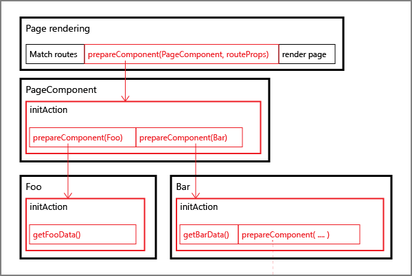
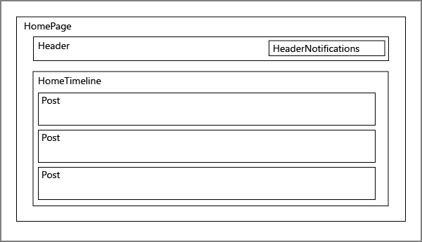

# Core concepts

Below is a technical explanation of the implementation for this library. For quick
setup instructions, [skip to setup](./setup.md){: .text-blue-000 }
{: .bg-green-300.text-grey-lt-000.p-3 }

## Initialization lifecycle
This is a short rundown of what happens on every page request

#### Server side
We don't start rendering until all components have been initialized.

 1. **Set initMode** the `initMode` is initially set to `MODE_PREPARE` to indicate that we want
 to initialize components before we mount them.
 2. **Component prepare** Before we start rendering, we need to call the initialization action of
 every component configured with `withInitAction()`[^1]. We refer to this as _preparing a component_
 and this can be done using the `prepareComponent()` action. For more info
 see [the prepare tree](#the-prepare-tree) below
 3. **Wait for preparation to complete** Before we render our page, we need to wait for the
 preparation to complete. This can be done using the promise returned by `prepareComponent()`
 4. **Render** Our page can now be rendered. To make sure we never skip an initialization action,
 all components configured with `withInitAction()` will throw an error if mounted without preparing
 it first.

[^1]: Note: components configured with `allowLazy` may skip this step. For more info see the [withInitAction() API docs](./api.html#withInitAction)

#### Client side
We don't want to redo initialization that has already been done on the server. When new components mount (for example, on client-side navigation), they should be initialized as well.

 1. **First render** this is essentially the same as step 4 on the server side. All component preparation has already been done on the server.
 2. **Set initMode** we dispatch `setInitMode(MODE_INIT_SELF)` to indicate that new components should initialize themselves as soon as they mount.
 3. **Next render(s)** If a new component wrapped in `withInitAction()` mounts, it will automatically initialize. Additionally, a component can also be configured to re-initialize if its `props` update.

Note: By default, the component will start rendering even if the `initAction` has not completed yet.
For more info see the [withInitAction() API docs](./api.html#withInitAction)
{: .bg-grey-lt-100.p-3 }

## The prepare tree
As described in _initialization lifecycle_ above, we need to dispatch `prepareComponent()` for each
component on the page before page render. But how do we know in advance which components will be
on our page? The trick is to configure our page component initialization to dispatch
`prepareComponent()` for each direct child component with an `initAction`. We configure the child
component initialization to dispatch `prepareComponent()` for their children, and so on. This way,
we only have to dispatch `prepareComponent()` on the page component we want to render and it will
recursively prepare its descendants.

## Example
Below is an example of a `HomePage` component layout. We will need to load the notifications to
display in the header, the list of posts, and some detail data for each post.

We use `withInitAction()` to add the following initialization to our components:
 - `Homepage` calls `prepareComponent(Header)` and `prepareComponent(HomeTimeline)`
 - `Header` calls `prepareComponent(HeaderNotifications)`
 - `HeaderNotifications` loads the notifications for the current user
 - `HomeTimeline` loads a list of posts. It now has a couple of post ids and
 calls `prepareComponent(Post, { id: postId })` for each post
 - `Post` loads some detail data to display the itself

Note: In this example, the list of posts are loaded separately from the post detail data. In another application this might be a single call
{: .bg-grey-lt-100.p-3 }

---

[Continue reading: Setup](./setup.md){: .btn .btn-purple }
{: .mb-10 }
